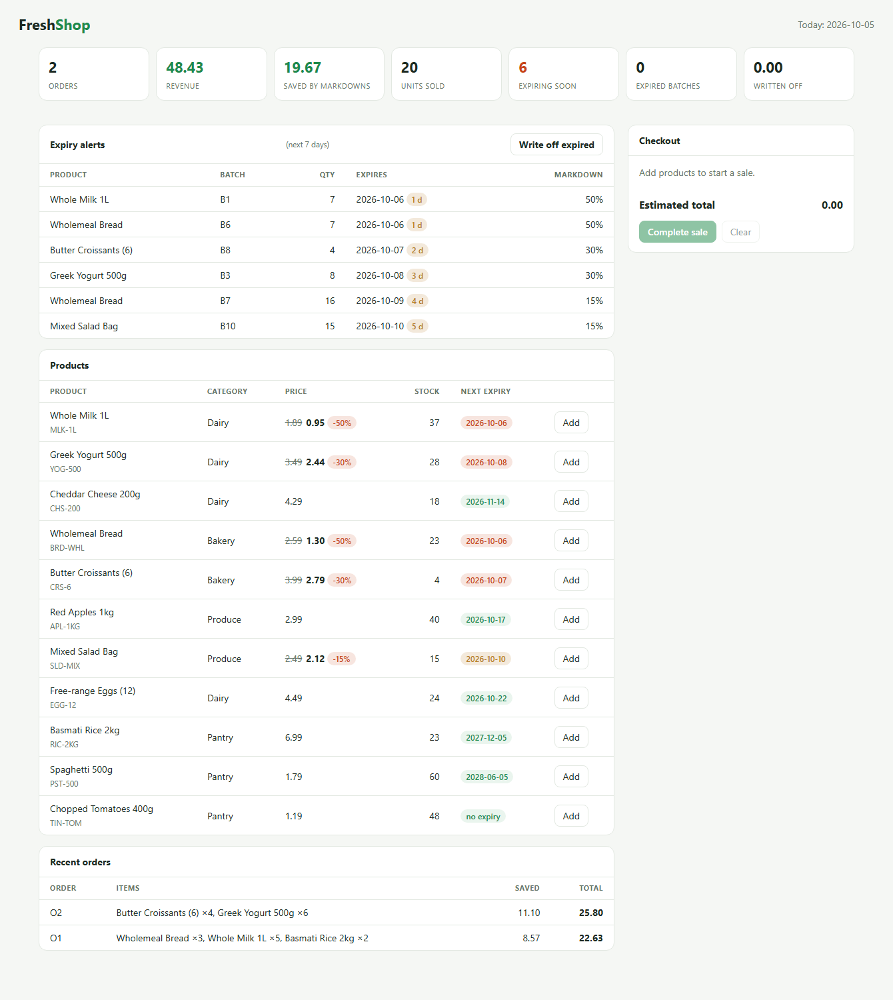

# FreshShop


A point-of-sale and inventory system for shops that sell **perishable goods** (groceries, bakeries,
dairy, pharmacies). It tracks stock per delivery batch, sells the oldest stock first, marks prices
down automatically as the expiration date approaches, and tells you what to pull from the shelf.

Written in plain Java 17 with **no third-party dependencies**: a REST API, a web dashboard and
JSON-file persistence, all on the JDK's built-in HTTP server.



## Why it exists

Food retailers lose money in two places: stock that expires unsold, and discounts applied by hand
(or not at all). FreshShop handles both from the same data:

- every delivery is a **batch** with its own manufacturing and expiration date
- checkout always takes from the batch that expires first (**FEFO**, first-expired-first-out)
- each batch is priced by how close it is to expiry, so old stock moves before it is wasted
- expired stock can never be sold, and writing it off records the loss

## Markdown rules

| Days until expiry | Discount |
|---|---|
| more than 7 | none |
| 4 - 7 | 15% |
| 2 - 3 | 30% |
| 0 - 1 (including the expiration day) | 50% |
| already expired | not sellable |

Products without an expiration date are always full price. The rules live in one small class,
[`PricingPolicy`](src/main/java/shop/service/PricingPolicy.java), so they are easy to change.

## Features

- Product catalog with categories; money stored as integer cents
- Batch-based inventory with manufacturing and expiration dates
- FEFO checkout that splits an order across batches and prices each line correctly
- All-or-nothing checkout: if any line cannot be fulfilled, nothing is deducted
- Expiry alerts, and a write-off action that records the lost value
- Sales report: orders, revenue, money saved by markdowns, revenue per category
- Web dashboard (light and dark mode) with a working cart
- JSON REST API
- State saved to a JSON file after every change, written atomically

## Run it

Requires JDK 17 or newer.

```bash
mkdir out
javac -d out $(find src/main -name '*.java')
cp -r src/main/resources/* out/
java -cp out shop.Main --seed
```

On Windows PowerShell:

```powershell
New-Item -ItemType Directory out -Force | Out-Null
javac -d out (Get-ChildItem -Recurse src/main -Filter *.java).FullName
Copy-Item -Recurse -Force src/main/resources/* out/
java -cp out shop.Main --seed
```

Then open <http://127.0.0.1:8080/>. Options:

| Flag | Default | Meaning |
|---|---|---|
| `--port` | 8080 | HTTP port |
| `--host` | 127.0.0.1 | Bind address |
| `--data` | shop-data.json | State file (loaded if it exists) |
| `--seed` | off | Load demo products and batches when there is no state file yet |

> The server has no authentication. It listens on localhost by default; put it behind a reverse proxy
> with auth before exposing it to a network.

## REST API

| Method and path | Description |
|---|---|
| `GET /api/products` | Products with stock, current (marked-down) price and next expiry |
| `POST /api/products` | `{"sku","name","category","priceCents"}` |
| `GET /api/products/{sku}` | One product with its batches |
| `POST /api/products/{sku}/batches` | Receive stock: `{"qty","mfg","exp"}` (dates `YYYY-MM-DD`, optional) |
| `GET /api/alerts?days=7` | Batches expired or expiring within N days |
| `POST /api/writeoff` | Remove expired batches, returns the lost value |
| `POST /api/orders` | Checkout: `{"items":[{"sku","qty"}]}` |
| `GET /api/orders` | Order history |
| `GET /api/report` | Sales and waste summary |

```bash
curl -X POST localhost:8080/api/orders \
  -d '{"items":[{"sku":"MLK-1L","qty":5},{"sku":"BRD-WHL","qty":3}]}'
```

Errors return `{"error": "..."}` with status 400 (rule violation or bad input) or 404 (unknown SKU/endpoint).

## Tests

```bash
javac -d out $(find src -name '*.java')
java -cp out shop.ShopTests
```

The suite covers pricing rules, FEFO allocation, atomic checkout, expiry and write-off, reports,
persistence round trips, the JSON parser and the HTTP API end to end. It runs on every push through
GitHub Actions.

## Project layout

```text
src/main/java/shop/
  model/      Item, Batch (MFGDate, EXPDate), Order
  service/    Shop (inventory and checkout), PricingPolicy, Persistence
  util/       small JSON reader/writer
  web/        ApiServer (REST + dashboard)
  Main.java   entry point
src/main/resources/web/   the dashboard (single HTML file)
src/test/java/shop/       test suite
```

## Roadmap

- Authentication and per-role permissions
- Supplier purchase orders and reorder suggestions
- Barcode lookup at checkout
- Database backend instead of the JSON file
